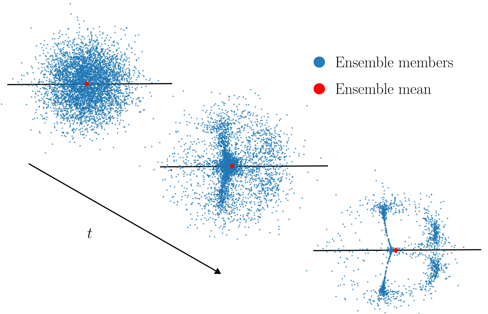

# Ensembles provably learn equivariance through data augmentation

This repository contains code for the paper "[Ensembles provably learn equivariance through data augmentation](https://arXiv.org/abs/2410.01452)".

## Contents

The directory contains the python files:

* ensemble_experiment_final.py
* experiment_evaluation_final.py
* plotting_final.py
* trainer_final.py
* equivariance_tester_final.py
* networks_final.py
* augmentation_final.py
* generate_subensembles_final.py

## Required packages

[pytorch](https://pytorch.org/get-started/locally/), [torchvision](https://pytorch.org/get-started/locally/), [numpy](https://numpy.org/), [matplotlib](https://matplotlib.org/), [tqdm](https://tqdm.github.io/)

## How to run the code

NOTE: Following these steps and executing the code on your system will create directories

First, train the ensemble by running `ensemble_experiment_final.py` with the flags
    
    ensemble_experiment_final.py --sym --syminit --members 1000 --epochs 10
    ensemble_experiment_final.py --asym --syminit --members 1000 --epochs 10
    ensemble_experiment_final.py --asym --asyminit --members 1000 --epochs 10

Then evaluate the experiments by running `experiment_evaluation_final.py` with the flags
   
    experiment_evaluation_final.py --sym --syminit --members 1000 --epochs 10 --allep --size
    experiment_evaluation_final.py --asym --syminit --members 1000 --epochs 10 --allep --size
    experiment_evaluation_final.py --asym --asyminit --members 1000 --epochs 10 --allep --size

Then plot the results `plotting_final.py` with the flags

    plotting_final.py --members 1000 --epochs 10

This will run the experiment as set up in the main paper, and display something similar to Figure 4 from the paper. Please note that running this code will take a VERY long time on a personal computer or laptop.

## Modifying the setup
Use the flags `--members` and `--epochs` to change the number of members/epochs. The initalization can be changed by flags `--asymint`/`--syminit`, and the supports with `--asym`/`--sym`. Note that `--sym` will always cause a symmetric initialization.

To evaluate a specific epoch, remove the flag `--allep` when calling the evaluation script; use the `--ep` flag to evaluate ensembles for a specific epoch. If one wishes to evaluate performance of subensembles please use the `--allsize` flag, it will generate and test subensembles of sizes N/10 and N/100 where N is the number of members in total; use the `--size` flag to only evaluate the entire ensemble and its individual members

To run the experiment for 5x5-filters: Go into the file `ensemble_experiment_final.py` and comment out lines 74-78, 90, 97 and remove the comments on lines 79-88, 91-94, 98-101, and go into the file `experiment_evaluation_final.py` and comment out lines 106-110, 122, 131 and remove the comments on lines 111-120, 123-126, 132-135. To run the code for other filter sizes, please modify the corresponding parts of the code.

## Copyright
The code is released under a Creative Commons Attribution-ShareAlike (CC BY-SA 2.0) licence. You are hence free to copy, re-distribute and modify the code as you please, as long as you credit us and use the same licence for your derived work. Also, please cite the paper!

    @article{nordenfors2024ensembles,
        author = {Oskar Nordenfors and Axel Flinth},
        title = {Ensembles provably learn equivariance through data augmentation},
        year = {2024},
        journal = {arXiv:2410.01452}
        }
