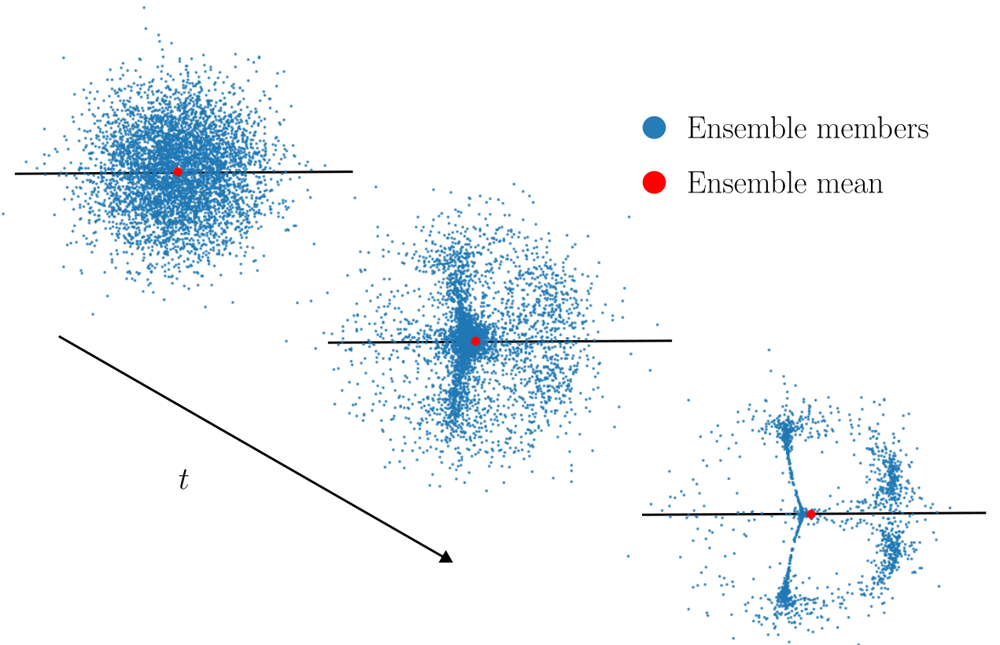

# Ensembles provably learn equivariance through data augmentation

This repository contains code for the paper "[Ensembles provably learn equivariance through data augmentation](https://arXiv.org/abs/2410.01452)".

## Required packages

[pytorch](https://pytorch.org/get-started/locally/), [torchvision](https://pytorch.org/get-started/locally/), [numpy](https://numpy.org/), [matplotlib](https://matplotlib.org/), [tqdm](https://tqdm.github.io/)

## Discrete rotation experiments

### How to run the code

NOTE: Following these steps and executing the code on your system will create directories.

First, train the ensemble by running `ensemble_experiment_final.py` with the flags
    
    python ensemble_experiment_final.py --sym --syminit --members 1000 --epochs 10 --C16
    python ensemble_experiment_final.py --asym --syminit --members 1000 --epochs 10 --C16
    python ensemble_experiment_final.py --asym --asyminit --members 1000 --epochs 10 --C16
    python ensemble_experiment_final.py --cnn --members 1000 --epochs 10 --C16

Then evaluate the experiments by running `experiment_evaluation_final.py` with the flags
   
    experiment_evaluation_final.py --sym --syminit --members 1000 --epochs 10 --allas --bootstraps 30 --C16
    experiment_evaluation_final.py --asym --syminit --members 1000 --epochs 10 --allas --bootstraps 30 --C16
    experiment_evaluation_final.py --asym --asyminit --members 1000 --epochs 10 --allas --bootstraps 30 --C16
    experiment_evaluation_final.py -cnn --members 1000 epochs 10 --epochs 10 --allas --bootstraps 30 --C16

Then plot the results `plotting_ensemble_sizes_final.py` with the flags

    plotting_final.py --members 1000 --epochs 10 --bootstraps 30 --C16

This will run the experiment for the $C_16$ as set up in the main paper, and display something similar to Figure 4 (right) from the paper. Please note that running this code will take a **VERY** long time on a personal computer or laptop. The experiments in the paper were made on a cluster, with thousands of jobs working in parallell.

### Modifying the setup
Use the flags `--members` and `--epochs` to change the number of members/epochs. The initalization can be changed by flags `--asymint`/`--syminit`, and the supports with `--asym`/`--sym`. Note that `--sym` will always cause a symmetric initialization. The flag `--cnn` is for generating standard full-support CNNs.

To change the group, change the flag `--C16` to `--C4` in all calls. To adjust the number of bootstraps in the evaluation, use the flag `--bootstraps`

To run the experiment for 5x5-filters: Go into the file `ensemble_experiment_final.py` and comment out lines 74-78, 90, 97 and remove the comments on lines 79-88, 91-94, 98-101, and go into the file `experiment_evaluation_final.py` and comment out lines 106-110, 122, 131 and remove the comments on lines 111-120, 123-126, 132-135. To run the code for other filter sizes, please modify the corresponding parts of the code.

## Copyright
The code is released under a Creative Commons Attribution-ShareAlike (CC BY-SA 2.0) licence. You are hence free to copy, re-distribute and modify the code as you please, as long as you credit us and use the same licence for your derived work. Also, please cite the paper!

    @article{nordenfors2024ensembles,
        author = {Oskar Nordenfors and Axel Flinth},
        title = {Ensembles provably learn equivariance through data augmentation},
        year = {2024},
        journal = {arXiv:2410.01452}
        }
